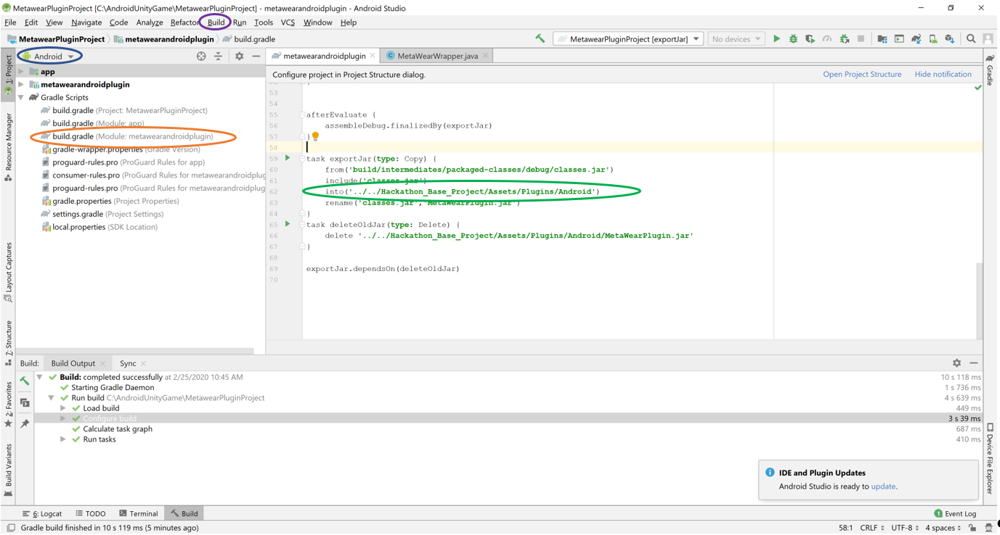

# MetaWear Android Plugin

The metawear plugin jar file is used to allow us to communicate with the metawear sdk provided by mbientlabs. This simple plugin currently allows us to communicate pitch, roll, yaw, and battery charge data from the metawear sensor to the C# script in unity. This is done through Java Native Interface (JNI) calls using functions provided by Unity. The C# call triggers a function in the Java code provided which initiates the connection with the device. The Java code then uses callback functions provided by unity to communicate with the C# code. This allows us to implement those values in the Unity game and allows us to use the sensor as a controller. We have provided the basics of functionality and editing the java code itself is entirely optional as we have already provided a jar file which contains these functions. This set of instructions are only for if you are interested in adding additional sensor functions.

## Android Studio installation and setup

1. Download Android Studio.

2. Make sure to install the Android SDK and SDK platform tools, as well as a JDK.

3. After installation completes, open Android Studio.

4. Navigate to Tools >> SDK Manager.

5. Under "SDK Tools", select "NDK (Side by side)" and "Google USB Driver" and install these additional tools.

## Build instructions for MetaWear Plugin

1. Open the Metawear Plugin Project in Android Studio.   

2. To do this, you go to File->Open->and select the folder titled “MetawearPluginProject”.  

3. Make sure the drop down menu circled in blue says android.  

4. After that, you need to open the build.gradle file labeled for the module “metawearandroidplugin”, circled in orange.

5. Once this file is open, make sure that the path circled in green (lines 62 and 66) links to your unity project in the Assets/Plugins/Android folder.

6. After making sure it is linked correctly, you are free to make any edits to the MetaWearWrapper.java class.

7. To recompile, you simply select build (circled in purple) and click “Make Module ‘metawearandroidplugin’”. This should automatically rebuild the .jar file used to interact with the metawear SDK and the script circled in green should automatically copy it to the unity project directory.

*NOTE:* You may need to change the “from” directory in the MetwearPlugin build.gradle file (line 60), depending on where in the “intermediates” directory the classes.jar file is generated.

## Tips

If you wish to access additional functions of the metawear sensor, you can learn about the different systems provided and see some example projects at the following links: 

General advice for setup and code chunks you can mostly copy-paste:  

https://mbientlab.com/androiddocs/latest/

Example projects:  
https://github.com/mbientlab/MetaWear-Tutorial-Android  
https://github.com/mbientlab/MetaWear-SampleApp-Android  

SDK source code:  
https://github.com/mbientlab/MetaWear-SDK-Android

- If you add in any new functions, you can mostly use the code provided from the first link’s different modules and copy paste the functions within the app.  
   - Don’t forget the import statements!  
   - It is recommended that any functions which call a new service from the board be initialized within the red circle on the image below.
       - Any function added here will be automatically performed during the initial connection.
       - If you want a function that can be called only when a specific value is requested, it will have to be its own function and will have to call back to the C# functions as discussed below.

- To call back to the C# functions, you simply need to add a function to your C# code that can catch the incoming data and call it with the UnityPlayer.UnitySendMessage function.
   - The data being sent must be a string which can be parsed on the C# script.
   - The data must communicate to a specific object as shown below where “BlueCharacter” refers to the object unity associates with the script, “changePitchValue” refers to a function of the C# script, and pitchStr is the string equivalent of the new pitch value coming in.

 
- Once the java code has been compiled, the C# code from the unity project calls it from the code shown below and initializes the connection to the sensor assigned to the team by the address.
   - Once connected, the sensor will begin automatically sending the pitch, yaw, and roll values.
   - If requested by the C# code, the java code will also notify the app of the device’s battery level.
      - The code to do this is commented out in the update function and can be added in anywhere with javaClass.Call("getBattery");
